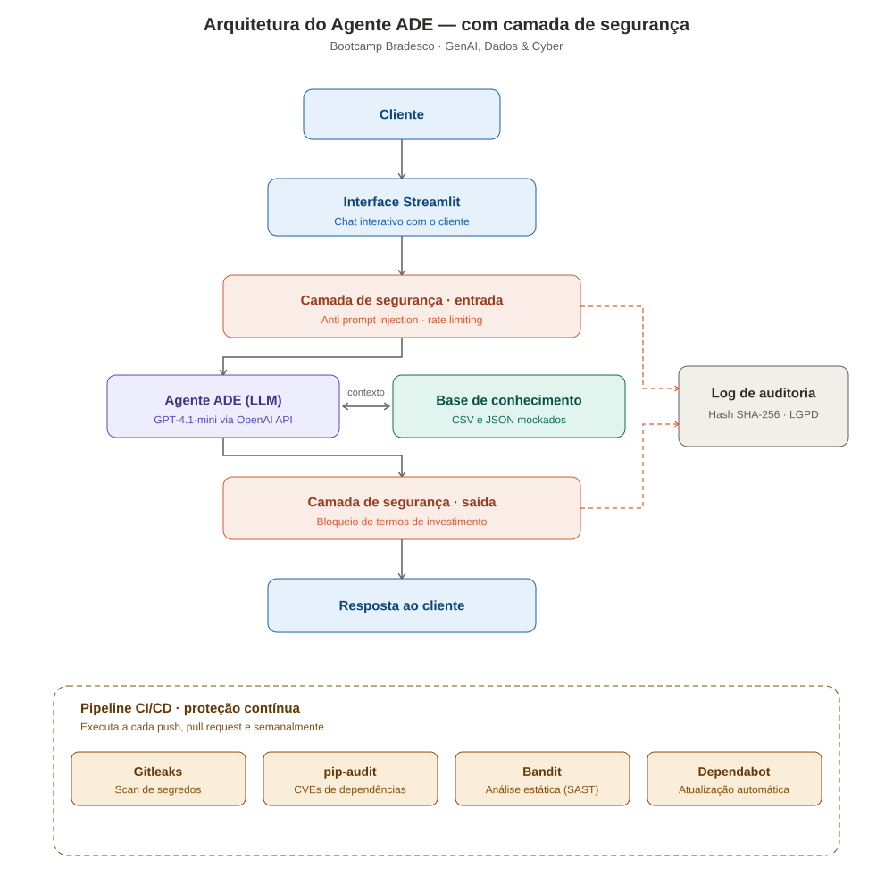
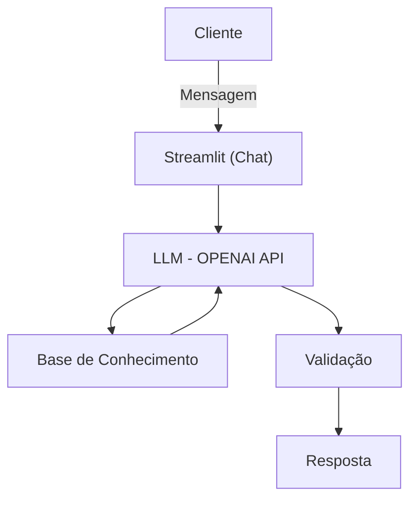

## 🚀 Nome do Projeto


### Agente ADE: Gestor Pessoal Financeiro Inteligente

## 📌 Visão Geral

Este projeto utiliza Inteligência Artificial para analisar hábitos financeiros, classificar despesas automaticamente e gerar insights personalizados.

O Agente ADE (Gestor Pessoal Financeiro Inteligente) é uma solução proprietária de inteligência artificial generativa projetada para a gestão estratégica de finanças pessoais. Este projeto transforma dados financeiros brutos em inteligência acionável, atuando como um consultor autônomo que antecipa necessidades e personaliza explicações financeiras com base no contexto real do cliente — sem nunca recomendar produtos ou aplicações específicas (ver [AGENTS.md](./AGENTS.md)).

## ⚙️ Funcionalidades do agente ADE

```
✅ Possui Base de Conhecimento carregada via código em Python
✅ Classificação automática de despesas
✅ Análise de padrões de consumo
✅ Respostas inteligentes via LLM (OpenAI API)
✅ Interface Streamlit com seletor de modos de atuação e painel de referência lateral
✅ Ações rápidas por modo, para começar a conversa mais rápido
✅ Sidebar com contexto do cliente e uso da sessão (custo, perguntas restantes)
✅ Gerar insights personalizados
✅ Só utiliza dados obtidos pelos arquivos da Base Conhecimento
✅ Comunicação Informal e acessível, educado, pró-ativo, atento
✅ Sempre pergunta se o cliente entendeu e se deseja mais explicações.
✅ Mantenha ética e conformidade regulatória.

❌ Anti-alucinação
❌ Não sugere aplicações financeiras
❌ Não responde a assuntos que não sejam financeiros
❌ NÃO faz suposições
❌ Se a informação não estiver no contexto, diga claramente que não sabe.
```

### Documentação complementar

```
✅ Documentação Agente: [`docs/01-documentacao-agente.md`](./docs/01-documentacao-agente.md)
✅ Base de Conhecimento:  [`docs/02-base-conhecimento.md`](./docs/02-base-conhecimento.md)
✅ Documentação Prompts: [`docs/03-prompts.md`](./docs/03-prompts.md)
✅ Documentação Métricas: [`docs/04-metricas.md`](./docs/04-metricas.md)
✅ Documentação Pitch: [`docs/04-pitch.md`](./docs/05-pitch.md)
✅ Documentação Segurança (Cyber): [`docs/06-seguranca-cyber.md`](./docs/06-seguranca-cyber.md)
✅ Definição do Agente (AGENTS.md): [`AGENTS.md`](./AGENTS.md)
```

## 🧠 Inteligência Artificial (OpenAI API)

O núcleo do Agente ADE é alimentado pelo modelo gpt-4.1-mini da OpenAI, selecionado por suas capacidades técnicas superiores:

```
✅ Seguimento de Instruções: O gpt-4.1-mini oferece alta precisão na execução de diretrizes complexas e governança financeira.

✅ Janela de Contexto: Com suporte a até 1 milhão de tokens, o modelo processa simultaneamente extensos históricos de transações e catálogos de produtos.

✅ Consultoria Proativa: A LLM é configurada para cruzar dados do perfil do usuário com conceitos de educação financeira, minimizando alucinações e garantindo respostas fundamentadas na base de conhecimento — sem recomendar produtos ou aplicações específicas.
```

## 💬 Experiência do Usuário

A aplicação (`src/app_secure.py`) usa layout `wide` com sidebar e um painel de
referência lateral, organizados em torno de **modos de atuação**:

```
✅ 5 modos: Chat Livre · Análise de Gastos · Metas e Reserva · Educação Financeira · Produtos
✅ Sidebar: seletor de modo, contexto do cliente, barra de progresso do custo da sessão
✅ Painel de referência lateral, conteúdo muda conforme o modo selecionado
✅ Ações rápidas por modo, para começar a conversa mais rápido
✅ Botão "Nova conversa" (reinicia o histórico, mantém os limites de segurança)
✅ Tema visual (.streamlit/config.toml) em vermelho Bradesco
```

> ℹ️ A API é consumida internamente com `stream=True` (reduz o tempo até a
> resposta completa chegar), mas o texto só é montado e exibido depois de
> passar pela checagem de compliance — por isso a resposta aparece de uma vez
> na tela (via `st.markdown`, dentro de um container com bolhas estilizadas
> em HTML), não em efeito de digitação. Como o layout usa HTML customizado em
> vez de `st.chat_message`, toda pergunta e resposta passa por escape de HTML
> (`escapar()`) antes de ser renderizada, para evitar XSS.

## 📊 Base de Conhecimento

A inteligência do agente é sustentada por uma infraestrutura de dados composta por quatro arquivos fundamentais localizados na pasta data/:

| Arquivo                       | Formato | Descrição                                                              |
| ----------------------------- | ------- | ------------------------------------------------------------------------ |
| `transacoes.csv`            | CSV     | Histórico detalhado de movimentações para análise de fluxo de caixa. |
| `historico_atendimento.csv` | CSV     | Registro de interações anteriores para manutenção de contexto.       |
| `perfil_investidor.json`    | JSON    | Mapeamento de objetivos, tolerância a risco e horizonte temporal.       |
| `produtos_financeiros.json` | JSON    | Catálogo estruturado de serviços e investimentos para recomendações. |

### Diagrama de Arquitetura





## 📁 Estrutura do Projeto

A organização do repositório segue a estrutura abaixo:

```
📁 dio-lab-bia-do-futuro

/
│
├── 📄 README.md
├── 📄 AGENTS.md                      # Definição do agente (persona, fluxo, restrições)
├── 📄 .gitignore
├── 📄 requirements.txt
│
├── 📁 .github/                       # Automação e segurança (CI/CD)
│   ├── dependabot.yml                # Atualização automática de dependências
│   └── 📁 workflows/
│       └── security.yml              # Pipeline: gitleaks + pip-audit + bandit + testes
│
├── 📁 .streamlit/                    # Configuração visual do Streamlit
│   └── config.toml                   # Tema (vermelho Bradesco)
│
├── 📁 data/                          # Dados mockados para o agente
│   ├── historico_atendimento.csv     # Histórico de atendimentos (CSV)
│   ├── perfil_investidor.json        # Perfil do cliente (JSON)
│   ├── produtos_financeiros.json     # Produtos disponíveis (JSON)
│   └── transacoes.csv                # Histórico de transações (CSV)
│
├── 📁 docs/                          # Documentação do projeto
│   ├── 01-documentacao-agente.md     # Caso de uso e arquitetura
│   ├── 02-base-conhecimento.md       # Estratégia de dados
│   ├── 03-prompts.md                 # Engenharia de prompts
│   ├── 04-metricas.md                # Avaliação e métricas
│   ├── 05-pitch.md                   # Roteiro do pitch
│   └── 06-seguranca-cyber.md         # Camada de segurança (OWASP LLM Top 10)
│
├── 📁 src/                           # Código da aplicação
│   ├── app.py                        # Versão original da aplicação
│   ├── app_secure.py                 # Versão recomendada: segurança + chat + streaming
│   ├── security_utils.py             # Funções puras de segurança (testáveis isoladamente)
│   └── requirements.txt
│
├── 📁 tests/                         # Testes automatizados (pytest)
│   └── test_security.py              # 40 testes da camada de segurança
│
├── 📁 assets/                        # Imagens e diagramas
│   └── ...
│
├── 📁 images/                        # Imagens ilustrativas do projeto
│   ├── arquitetura-ade-seguranca.svg # Diagrama de arquitetura + camada de segurança
│   └── banner-ade.svg                # Banner ilustrativo do chatbot
│
└── 📁 examples/                      # Referências e exemplos
    └── README.md
```

> 🔐 **Nota:** `src/app_secure.py` é a versão recomendada para uso — além da
> camada de segurança (prompt injection, rate limiting, tratamento seguro de
> erros e auditoria, ver [`docs/06-seguranca-cyber.md`](./docs/06-seguranca-cyber.md)),
> inclui a interface de chat completa descrita em
> [💬 Experiência do Usuário](#-experiência-do-usuário).
> Para adotá-la como principal, renomeie/substitua o `app.py`:
> `mv src/app_secure.py src/app.py`.

## 🛠️ Stack Tecnológica

| Arquivo       | Descrição                                                                                 |
| ------------- | ------------------------------------------------------------------------------------------- |
| Interface     | Streamlit (layout wide, seletor de modos, painel de referência lateral, tema customizado). |
| Processamento | Pandas e NumPy                                                                              |
| Validação   | Pydantic (Garantia de integridade dos dados).                                               |
| IA            | OpenAI API (`gpt-4.1-mini`), com `stream=True` para reduzir latência percebida.        |

## 📦 Instalação e Execução

Clone o repositório:

```
bash
git clone https://github.com/ademarbarreto/dio-lab-bia-do-futuro-cyber.git
```

Configuração do Ambiente:

```
bash
python -m venv venv
source venv/bin/activate  # Windows: venv\Scripts\activate
pip install -r requirements.txt
```

Variáveis de Ambiente: Crie um arquivo .env na raiz do projeto:

```
bash
OPENAI_API_KEY=sua_chave_aqui
OPENAI_MODEL=gpt-4.1-mini
```

Iniciar a Aplicação (versão recomendada — chat completo + segurança):

```
bash
streamlit run src/app_secure.py
```

Ou, para rodar a versão original (formulário simples, sem as camadas de
chat e segurança adicionais):

```
bash
streamlit run src/app.py
```

Rodar os testes automatizados da camada de segurança:

```
bash
pip install pytest
pytest tests/ -v
```

## 🔒 Segurança (Cyber)

Camada de segurança desenvolvida para o Bootcamp Bradesco - GenAI, Dados & Cyber,
mapeada ao [OWASP Top 10 for LLM Applications](https://owasp.org/www-project-top-10-for-large-language-model-applications/):

```
✅ Defesa contra Prompt Injection (LLM01)
✅ Validação e bloqueio de saída não compliant (LLM02)
✅ Tratamento seguro de erros — sem stack trace exposto (LLM06)
✅ Rate limiting e bloqueio preventivo de custo (LLM10)
✅ Log de auditoria com hash da pergunta (LGPD)
✅ Pipeline CI/CD: gitleaks (secret scan) + pip-audit (CVEs) + bandit (SAST)
✅ Dependabot para atualização automática de dependências
✅ 40 testes automatizados (pytest) para a camada de segurança
```

📄 **Documentação completa:** [`docs/06-seguranca-cyber.md`](./docs/06-seguranca-cyber.md)
⚙️ **Pipeline:** [`.github/workflows/security.yml`](./.github/workflows/security.yml)

## ✒️ Autor

Projeto desenvolvido por **Ademar Silva Barreto Junior** como uma solução original de gestão financeira inteligente baseada em IA Generativa.

Este repositório reflete o desenvolvimento completo de documentação e código do Agente ADE.


- ✉ **Email:** [ademar.barreto@gmail.com](mailto:ademar.barreto@gmail.com)
- 💼 **LinkedIn:** [ademarsilvabarretojunior](https://www.linkedin.com/in/ademarsilvabarretojunior/)
- ✍️ **Portfólio:** [ademarbarreto.github.io](https://ademarbarreto.github.io)
- 💻 **GitHub:** [ademarbarreto](https://github.com/ademarbarreto)
- ✍️ **Medium:** [@ademar.barreto](https://medium.com/@ademar.barreto)
- 📞 **Telefone:** + 55 (21) 99156-7836
